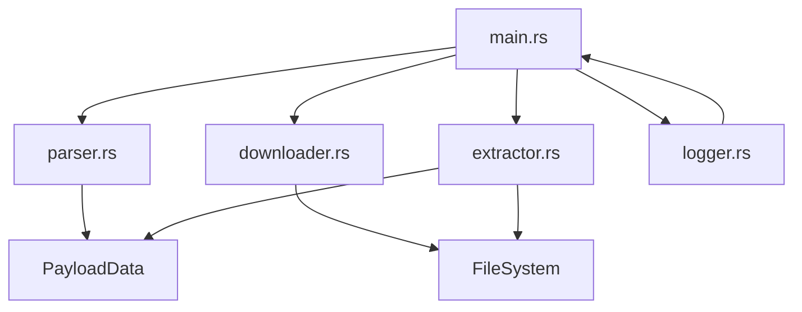

# System Design: canvas-payload-parser

## Architecture Overview

A Rust CLI tool that reads a Canvas LMS course payload JSON file, downloads course materials, extracts grades, identifies video links, and provides detailed logging. The tool parses /tmp/course_payload.json, organizes downloads by course/module, and outputs structured data to JSON files.

## Component Diagram


```

## Components

### main

**Purpose**: CLI entry point, orchestrates parsing, downloading, and extraction

**Interface**:
- main
- run

**Dependencies**: parser, downloader, extractor, logger

### parser

**Purpose**: Reads and validates Canvas payload JSON file

**Interface**:
- read_payload
- validate_json

### downloader

**Purpose**: Downloads course module files to organized directory structure

**Interface**:
- download_files
- create_directory_structure

**Dependencies**: parser

### extractor

**Purpose**: Extracts grades and video links from payload

**Interface**:
- extract_grades
- extract_videos
- save_to_json

**Dependencies**: parser

### logger

**Purpose**: Provides structured logging with timestamps and operation tracking

**Interface**:
- log_operation
- log_summary
- log_error

### models

**Purpose**: Data structures for Canvas payload entities

## File Structure

```
canvas-payload-parser/
├── src/
│   ├── main.rs
│   ├── parser.rs
│   ├── downloader.rs
│   ├── extractor.rs
│   ├── logger.rs
│   └── models.rs
├── downloads/
├── output/
├── Cargo.toml
└── README.md
```

## Technology Stack

- **Language**: rust
- **Testing**: cargo test
- **Build Tool**: cargo

## Design Decisions

- Use serde_json for payload parsing: Standard Rust JSON library with strong typing and error handling
- Async downloads with reqwest/tokio: Enables concurrent file downloads for better performance
- Continue on individual download failures: Maximizes data retrieval even when some files are unavailable
- Separate output formats for grades and videos: Makes extracted data easily consumable by other tools
- Use clap for CLI argument parsing: Provides standard --help and --version flags with minimal code


## Designer Refinement

- Added orchestration handoff contract for specialist parallel agents.
- Added project-manager feedback checkpoint before next loop iteration.
